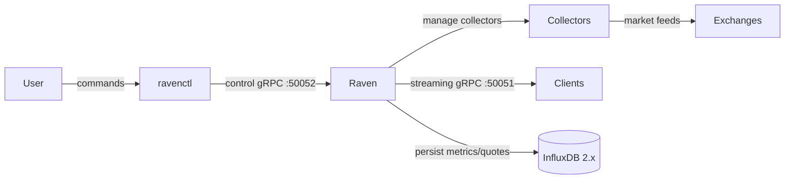

# Raven

Raven is a Rust-powered market data platform built around two CLIs:
- `raven` runs the streaming server that exposes market data over gRPC and manages collector lifecycles.
- `ravenctl` is the control-plane client used to start, stop, and inspect collectors from an operator shell.

## Using Raven and Ravenctl

### Install the binaries
Option A: use a published release.
```bash
VERSION=v0.1.5
wget https://github.com/skkugoon/raven/releases/download/${VERSION}/raven-${VERSION}-x86_64-unknown-linux-gnu.tar.gz
tar -xzf raven-${VERSION}-x86_64-unknown-linux-gnu.tar.gz
sudo mv raven ravenctl /usr/local/bin
raven -V && ravenctl --version
```

Option B: build locally.
```bash
cargo build --release --bins
cp target/release/raven target/release/ravenctl /usr/local/bin
```

### Configure
1. Copy `config/example.toml` to `config/development.toml`.
2. Fill in InfluxDB 2.x credentials and any exchange-specific settings.
3. Set the environment when running (default is `development`): `ENVIRONMENT=development`.

### Run the server
```bash
# Start Raven with default config for the chosen environment
ENVIRONMENT=development cargo run --bin raven

# Or point to an explicit config file
cargo run --bin raven -- --config config/development.toml
```

### Manage collectors with ravenctl
```bash
# Start Binance futures collection for BTCUSDT
cargo run --bin ravenctl -- use --exchange binance_futures --symbol BTCUSDT

# Stop the collection
cargo run --bin ravenctl -- stop --exchange binance_futures --symbol BTCUSDT

# List active collectors
cargo run --bin ravenctl -- list

# Validate or show config
cargo run --bin ravenctl -- validate --config config/development.toml
cargo run --bin ravenctl -- show --format json
```

### Interaction overview


## Developer Guide
- **Prerequisites:** Rust 1.70+, Cargo, and access to an InfluxDB 2.x instance.
- **Build:** `cargo build` for quick compiles; `cargo build --release` for optimized binaries.
- **Format & lint:** `cargo fmt` then `cargo clippy --all-targets --all-features -- -D warnings`.
- **Tests:** `cargo test --all`; keep unit suites under `tests/unit/` and integration flows under `tests/integration/`.
- **Run locally:** `ENVIRONMENT=development cargo run --bin raven` to launch the server; use `ravenctl` commands above to orchestrate collectors.
- **Protos:** edit files in `proto/` and rebuild bindings via `cargo build` (handled by `build.rs`).

### Repository layout
- `src/server` – gRPC server for market data plus subscription routing.
- `src/data_engine` – validation, high-frequency storage, and persistence paths.
- `src/data_handlers` – exchange feed adapters (e.g., Binance spot/futures).
- `src/subscription_manager` – client state, heartbeats, and topic routing.
- `src/monitoring` – health checks, metrics, and tracing utilities.
- `src/bin/ravenctl.rs` – control-plane CLI that calls the server’s gRPC control service.
- `tests/` – unit (`tests/unit`) and integration (`tests/integration`) suites.
- `python_client/` – smoke-test client aligned with the protobuf schema.
