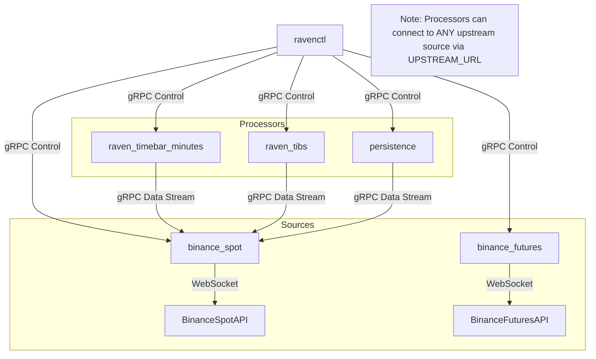

# Raven

Raven is a Rust-powered market data platform built around two CLIs:
- `raven` runs the streaming server that exposes market data over gRPC and manages collector lifecycles.
- `ravenctl` is the control-plane client used to start, stop, and inspect collectors from an operator shell.

## Using Raven and Ravenctl

### Install the binaries
Option A: use a published release.
```bash
VERSION=v0.1.5
wget https://github.com/skkugoon/raven/releases/download/${VERSION}/raven-${VERSION}-x86_64-unknown-linux-gnu.tar.gz
tar -xzf raven-${VERSION}-x86_64-unknown-linux-gnu.tar.gz
sudo mv raven ravenctl /usr/local/bin
raven -V && ravenctl --version
```

Option B: build locally.
```bash
cargo build --release --bins
cp target/release/raven target/release/ravenctl /usr/local/bin
```

Yes, the system is **fully integrated**. We have successfully transitioned from a monolithic logic to a **modular, microservices-based architecture**.

Here is the complete system overview:

### **1. System Architecture**
The system is composed of specialized binaries that communicate via **gRPC**. They all share the same protocol definitions (`proto/`) and service boilerplate (`src/service/`), ensuring compatibility.



### **2. Component Breakdown**

| Service | Role | Port (gRPC) | Port (Metrics) | Description |
| :--- | :--- | :--- | :--- | :--- |
| **`binance_spot`** | **Source** | `50051` | `51051` | Connects to Binance Spot WS. Streams raw trades/orderbooks. |
| **`binance_futures`**| **Source** | `50054` | `51054` | Connects to Binance Futures WS. Streams raw trades. |
| **`persistence`** | **Consumer** | `50052` | `51052` | Subscribes to an upstream source and writes data to **InfluxDB**. |
| **`raven_timebar_minutes`** | **Aggregator**| `50053` | `51053` | Subscribes to trades, aggregates them into **1m Candles**, and streams them out. |
| **`raven_tibs`** | **Aggregator**| `50055` | `51055` | Subscribes to trades, runs **Tick Imbalance** logic, and streams TIBs out. |
| **`ravenctl`** | **Control** | N/A | N/A | CLI tool to start/stop collections and check status on any service. |

### **3. Integration Logic**
The integration works through a **demand-driven chain**:
1.  **Control**: You tell a downstream service (e.g., `raven_tibs`) to start collecting `BTCUSDT`.
2.  **Propagation**: `raven_tibs` automatically connects to its configured **Upstream** (e.g., `binance_spot`) and sends a gRPC subscription request.
3.  **Source Activation**: `binance_spot` receives the subscription. If it's not already connected to the WebSocket for that symbol, it connects immediately.
4.  **Data Flow**:
    *   Binance WS sends a trade.
    *   `binance_spot` parses it and streams it to `raven_tibs`.
    *   `raven_tibs` updates its internal state (Theta, EWMA).
    *   When a bar closes, `raven_tibs` streams the bar to any of *its* clients.

### **4. Operational Guide**

To run the full "Spot -> TIBs" pipeline:

**Terminal 1: Start the Source (Binance Spot)**
```bash
cargo run --bin binance_spot
```

**Terminal 2: Start the Aggregator (TIBs)**
*Points to binance_spot by default via `UPSTREAM_URL`*
```bash
export UPSTREAM_URL=http://localhost:50051
cargo run --bin raven_tibs
```

**Terminal 3: Control the System**
*Tell TIBs to start. This implicitly starts Spot data collection.*
```bash
cargo run --bin ravenctl -- --host http://localhost:50055 start --symbol BTCUSDT
```

**Terminal 4: Monitor**
```bash
# Check TIBs metrics
curl -s http://localhost:51055/metrics | grep raven_tibs

# Check Spot metrics (should show active connection)
curl -s http://localhost:51051/metrics | grep raven_binance
```