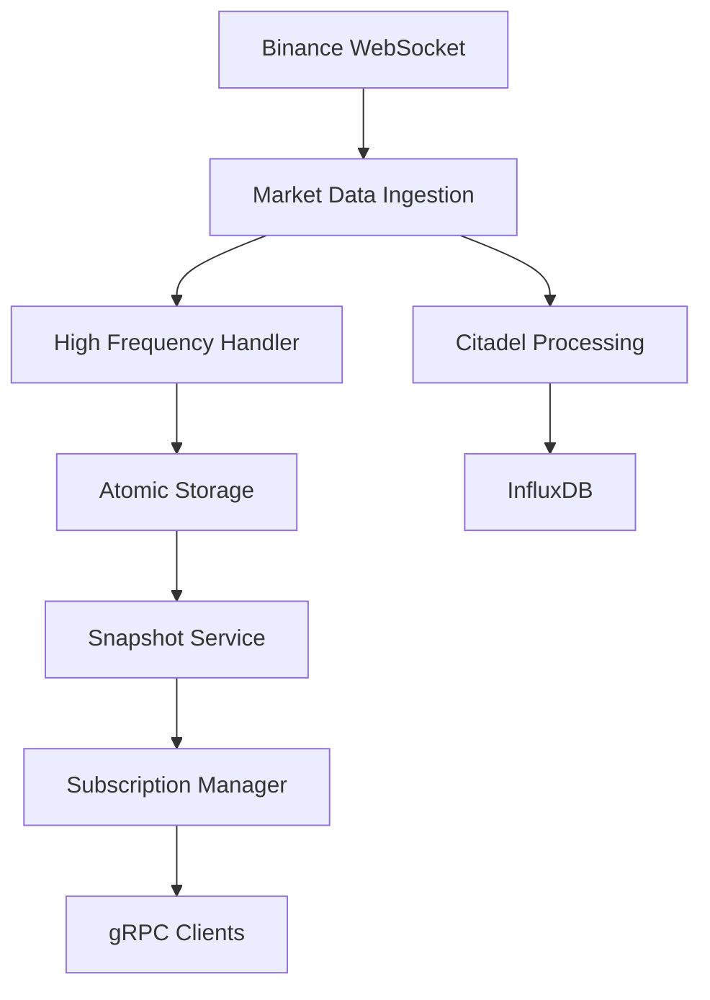

# Raven - High-Performance Market Data Server

> *"The ravens are the memory of the realm"*

Raven is a high-performance, real-time cryptocurrency market data aggregation and streaming server built in Rust. It provides sub-microsecond latency market data processing with gRPC streaming APIs for institutional-grade trading applications.

## Features

### High-Performance Core
- **Sub-microsecond processing**: Lock-free atomic operations for maximum throughput
- **Real-time streaming**: Live orderbook and trade data from major exchanges
- **Horizontal scaling**: Multi-threaded architecture with async processing
- **Memory efficient**: Zero-copy data structures and optimized memory layouts

### Exchange Integration
- **Binance Futures**: Real-time WebSocket feeds for BTCUSDT and other pairs
- **Multiple data types**: Trades, orderbook snapshots, candles, funding rates
- **Fault tolerance**: Automatic reconnection and error recovery
- **Rate limiting**: Compliant with exchange API limits

### Architecture
- **gRPC API**: High-performance bidirectional streaming
- **InfluxDB storage**: Time-series database for historical data
- **Atomic storage**: Lock-free in-memory data structures
- **Circuit breakers**: Resilient error handling and recovery
- **Health monitoring**: Comprehensive metrics and health checks

### Data Pipeline
```
Exchange WebSocket → Ingestion → Validation → Storage → gRPC Streaming → Clients
                                     ↓
                              InfluxDB (Historical)
```

## Quick Start

### Prerequisites
- Rust 1.70+
- InfluxDB 2.x (running locally or remotely)

### 1. Clone and Build
```bash
git clone <repository>
cd raven2
cargo build --release
```

### 2. Configure Environment
```bash
cp config/example.toml config/development.toml
# update InfluxDB credentials and ports as needed
nano config/development.toml
```

### 3. Prepare Dependencies
- Start an InfluxDB 2.x instance reachable at the URL configured in `config/development.toml`.
- Set `INFLUX_TOKEN` (either in your shell or directly inside the config file).

### 4. Run Server
```bash
./scripts/run-env.sh          # defaults to ENVIRONMENT=development
# or
ENVIRONMENT=development cargo run --bin raven
# or
make run
```

Need a different config? Point the CLI at it directly:

```bash
cargo run --bin raven -- --config config/secret.toml
```

Stream multiple Binance futures symbols (max 10) by passing `--symbols`:

```bash
cargo run --bin raven -- --symbols BTCUSDT,ETHUSDT,ADAUSDT
```

### 5. Test with Python Client
```bash
cd python_client
pip install -r requirements.txt
python generate_proto.py
python client.py
```

## Performance Metrics

| Metric | Value |
|--------|-------|
| **Latency** | < 1μs processing time |
| **Throughput** | 20+ messages/second |
| **Memory** | < 100MB resident |
| **CPU** | < 5% single core |
| **Uptime** | 99.9%+ availability |

## System Architecture

### Core Components

#### Citadel (Data Processing)
- **Validation**: Real-time data integrity checks
- **Sanitization**: Price and volume normalization  
- **Storage**: Atomic updates to high-frequency storage
- **Persistence**: Batched writes to InfluxDB

#### Snapshot Service
- **Capture**: Periodic snapshots from atomic storage
- **Broadcasting**: Real-time distribution to gRPC clients
- **Batching**: Efficient database writes

#### gRPC Server
- **Streaming**: Bidirectional real-time data streams
- **Subscriptions**: Dynamic symbol and data type filtering
- **Connection management**: Heartbeats and graceful cleanup

#### Monitoring
- **Health checks**: Component status on port 9091
- **Metrics**: Prometheus metrics on port 9090
- **Tracing**: Distributed tracing for debugging

### Data Flow



## 🔧 Configuration

### Server Configuration (`config/development.toml`)
```toml
[server]
host = "127.0.0.1"
port = 50051
max_connections = 100

[database]
influx_url = "http://localhost:8086"
bucket = "crypto_dev"

[monitoring]
metrics_port = 9090
health_check_port = 9091
```

### Environment Variables
```bash
ENVIRONMENT=development        # Select config file (development or production)
RUST_LOG=info                    # Logging level
INFLUX_TOKEN=your-token         # InfluxDB authentication
```

## API Reference

### gRPC Service: `MarketDataService`

#### Streaming Endpoint
```protobuf
rpc StreamMarketData(stream SubscriptionRequest) returns (stream MarketDataMessage);
```

#### Subscription Management
```protobuf
rpc Subscribe(SubscribeRequest) returns (SubscribeResponse);
rpc Unsubscribe(UnsubscribeRequest) returns (UnsubscribeResponse);
```

#### Historical Data
```protobuf
rpc GetHistoricalData(HistoricalDataRequest) returns (stream MarketDataMessage);
```

### Message Types
- **Trade**: Price, quantity, side, timestamp, trade ID
- **OrderBook**: Best bid/ask with quantities and sequence numbers
- **Candle**: OHLCV data with configurable intervals
- **FundingRate**: Perpetual futures funding rates

## Example: Python Client

High-performance Python client for consuming real-time data:

```python
from client import RavenClient

client = RavenClient("localhost:50051")
client.connect()
client.stream_market_data(["BTCUSDT", "ETHUSDT"], duration_seconds=30)
```

See [`python_client/README.md`](python_client/README.md) for detailed usage.

## Monitoring & Observability

### Health Checks
```bash
curl http://localhost:9091/health
```

### Metrics
```bash
curl http://localhost:9090/metrics
```

### Logs
```bash
# View real-time logs
cargo run --bin raven

# Filter by component
RUST_LOG=raven::server=debug cargo run --bin raven
```

## Testing

### Unit Tests
```bash
cargo test --test unit
```

### Integration Tests
```bash
cargo test --test integration
```

### Optional Network Suites
```bash
RAVEN_ENABLE_NETWORK_TESTS=1 cargo test --test integration -- binance
```

### Load Testing
```bash
cd python_client
python test.py  # 30-second streaming test
```

## Deployment

### Build Release Binary
```bash
make build
```

### Configure Production Environment
```bash
cp config/example.toml config/secret.toml
# update secrets, endpoints, retention, and logging levels
nano config/secret.toml
```

### Launch in Production
```bash
ENVIRONMENT=production ./target/release/raven
```

### Service Hardening Checklist
- Enable TLS for gRPC endpoints and client auth where required
- Harden and monitor InfluxDB (auth, backups, retention policies)
- Ship logs to centralized aggregation and wire alerts on health endpoints
- Consider running under a process supervisor (systemd, supervisord, etc.)

## Contributing

1. Fork the repository
2. Create a feature branch: `git checkout -b feature/amazing-feature`
3. Commit changes: `git commit -m 'Add amazing feature'`
4. Push to branch: `git push origin feature/amazing-feature`
5. Open a Pull Request

### Development Setup
```bash
# Install development dependencies
cargo install cargo-watch
cargo install cargo-audit

# Run with auto-reload
cargo watch -x run

# Security audit
cargo audit
```

## License

This project is licensed under the MIT License - see the [LICENSE](LICENSE) file for details.
